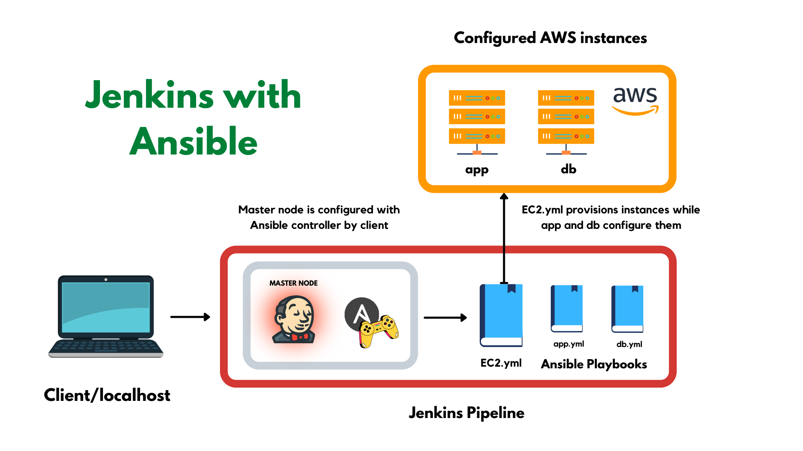

[Jenkins and CICDE Pipelines](#jenkins-and-cicde-pipelines)
    - [In Jenkins](#in-jenkins)
  - [Setting Up a Master Jenkins (AWS)](#setting-up-a-master-jenkins-aws)
  - [Setting up an SSH on Jenkins](#setting-up-an-ssh-on-jenkins)
  - [Setting up a webhook](#setting-up-a-webhook)
    - [Glossary](#glossary)
  - [Agent Node](#agent-node)

# Jenkins and CICDE Pipelines

The process:


Localhost > SHH to GitHub > SSH to Jenkins > automated tests in Jenkins Agent and Master nodes > AWS.

Jenkins has an agent and a master node

Step 1:
- Create SSH connection from localhost to GitHub
  1.1: 
  - Generate SSH key-pair _(key & lock)_ on locahost
- 1.2:
  - Put the lock on GitHub by copying the public SSH key to GitHub
  - Create a new repo for CICD on our GitHub


GitHub key gen:
ssh-keygen -t rsa -b 4096 -C "<emailaddress@x.com>"
Set a name "<name>"
Enter pass: we skip by pressing enter

This creates two files: 103a and 103a.pub

On GitHub, go to settings > SSH & GPG keys > "New SSH Key" > enter title and paste the key from the 103a.pub file. 
- Do this by typing `cat 103a.pub` and copy the key presented
- Copy it end to end, make sure you don't miss any and that there are 0 spaces anywhere.
- It will ask you to enter your password and then add the key to your account. 

### In Jenkins

- Create new jobs: Freestyle Project
- Discard old builds > max # of builds to keep = 3
- Build > Add Build Step > Execute Shell: 
```
uname -a
date
```
- Apply and Save
- In left sidebar, "Build Now", will return a status 

## Setting Up a Master Jenkins (AWS)

- Launch an ubuntu instance and ssh into it
- Run `sudo apt-get update` and `sudo apt-get upgrade`
- Run `sudo apt install default-jre` _(java-runtime-environment)_ followed by:

```
curl -fsSL https://pkg.jenkins.io/debian-stable/jenkins.io.key | sudo tee \
    /usr/share/keyrings/jenkins-keyring.asc > /dev/null

echo deb [signed-by=/usr/share/keyrings/jenkins-keyring.asc] \
    https://pkg.jenkins.io/debian-stable binary/ | sudo tee \
    /etc/apt/sources.list.d/jenkins.list > /dev/null

sudo apt-get update
  sudo apt-get install jenkins

{documentation link: https://pkg.jenkins.io/debian-stable/}
```

- When you go to jenkins, itll ask for a authentication key. You find this by SSHing into the server and running:
- `sudo cat /var/lib/jenkins/secrets/initialAdminPassword`


## Setting up an SSH on Jenkins

- Create new
- Enter name
- Discard old builds = 3
- Github project url = HTTPS link project of repo. When it asks for a url, use https.
- 
- Office 365 connector > restrict > we're using a precreated label called sparta-ubuntu-node
- Source code management > git > repository url: ssh key (repo url is ssh, project url is https)
- We now need to provide the private key to Jenkins
  - to add a key:
  - click add > jenkins > kind: SSH Username with private key > select private key > add: private ssh key (include _all_ text)
  - chain branch specifier to /main
  - add build > execute shell > enter path of test folder
  - in script: `cd app, npm install, npm test`
  - Build environment > tick provide node & npm (this saves us from having to install node and all packages)

With this, we still had to manually press build now. For a full CICD pipeline, we need this to run automatically from a localhost commit. 

## Setting up a webhook

- Configure Jenkins and ensure Build triggers > "Github hook trigger for GITScm polling" is enabled
- Go to Github repo > settings > webhooks
- Add webhook > payload url: Jenkins dashboard url/github-webhook (you have to add the github-webhook part)
- Content type: application json.


### Glossary

SSH: 
Think of it as a key and a lock. 
There are private and public keys. 
Localhost will generate two keys: keyName and keyName.pub. The .pub extension is what we paste into our GitHub account to authenticate. 

Webhook:

A webhook is listening for any ages 24/7. 
When it receives a change from a valid user, it will automatically trigger the process and inform Jenkins. 
Jenkins will run a test and trigger a pass/fail response from Master Node. If fail, nothing happens. If pass, Jenkins will respond that it's ready to deploy them and make the changes on AWS. 

Continuous Integration:
- Ensuring that the code on your local host is continuously integrated into your GitHub, automatically process and integrating any changes on every level.
- From a single git push on local host, the changes should be integrated at every step until AWS automatically. 
  1. _A developer pushes new code to a remote source control repository._
  2. _That new code gets built in a pre-configured sever._
  3. _If the build succeds, the new code is added to the solution._
  4. _Could have a continuous testing element too, having to pass User Interface tests or making sure certain features return the values expected._


Continuous Delivery:
- If the tests all pass, Jenkins will automatically deliver the changes into our instances on AWS. This is delivery. But it is NOT LIVE. We still have to do `npm start` physically.

Continuous Deployment:
- This is when the integration and delivery processes result in an automatic deployment or start of the service/update. This could not happen because of things like business decisions etc. 

Since many of the tasks are now automated, any team can significantly **speed up the delivery of new value, reduce bottlenecks, and avoid common integration problems**. 

## Agent Node

Set up agent and master node
SSH into them

In Master: 
`ssh-keygen`
`cat ~/.ssh/id_rsa.pub`
In Agent:
`echo '<paste here the id_rsa.pub content>' >> ~/.ssh/authorized_keys`
In Master:
`ssh ubuntu@<jenkins-agent-private-ip>`

this is how we check if it allows us to connect to the agent from the master

In agent:
`sudo apt-get update`
`sudo apt-get install -y openjdk-8-jdk` < installing java >
sudo apt-get install openssh-server
mkdir ~/jenkins

Go to jenkins > manage jenkins > configure cloud 
For credentials > AWS credentials > enter key id and secret access key from excel file
Paste ami ID, select 

